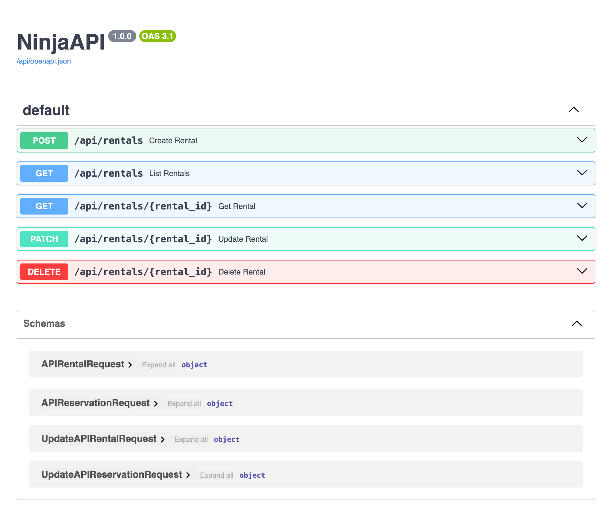
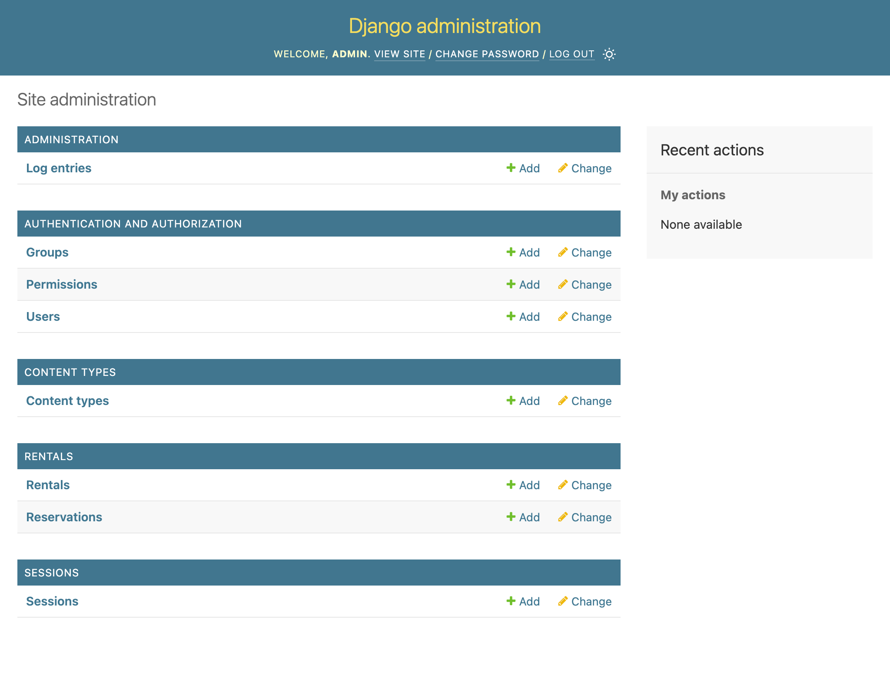
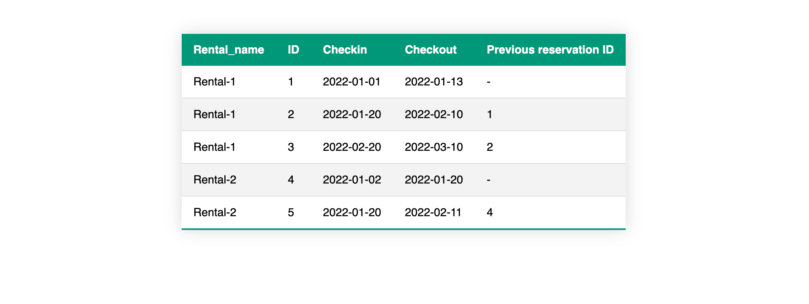

# Rentals
This project follows many good practices:
* To manage scripts follow the: https://github.com/github/scripts-to-rule-them-all
* Many of the good practices follow what is in Cosmic Python book https://www.cosmicpython.com/book/preface.html
* Using Django Ninja to generate API with docs

## Development
Local development use Nix: https://determinate.systems/posts/determinate-nix-installer/

After install Nix, add also direnv and nix-direnv:

```bash
nix profile install nixpkgs#direnv
nix profile install nixpkgs#nix-direnv
```

First time accessing the folder we need to allow it to run direnv and nix:

```bash
direnv allow
```

After this those commands should work:

```
scripts
├── bootstrap
├── build
├── format
├── lint
├── setup
├── start
├── test
└── update
```

To get the environment ready, run the script `setup`

```bash
./scripts/setup
```

To start the server, run the script `start`

```bash
./scripts/start
```

To run unit tests, run the script `test`
```bash
./scripts/test
```


## Docker
It's provided a docker image of the project: https://github.com/users/rodfersou/packages/container/package/rentals-api

And those scripts use it:

```
scripts
├── start-docker
└── test-docker
```

If you just want to run the application with docker, can use the script `start-docker`

```bash
./scripts/start-docker
```


If you just want to run the tests with docker, can use the script `test-docker`

```bash
./scripts/test-docker
```

## The APP
After start the app, you can access the API docs in the URL: http://localhost:8000/api/docs


The login and password of the django-admin is both `admin`: http://localhost:8000/admin


The APP showing the table is in the page root: http://localhost:8000

